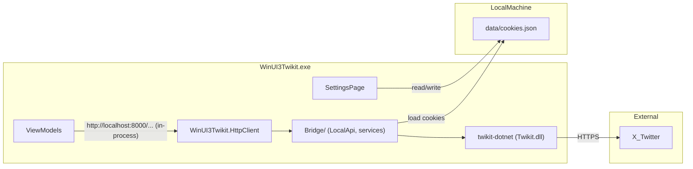

# WinUI-3-twikit

**English summary:** A WinUI 3 desktop client for X (Twitter), backed by [twikit-dotnet](https://github.com/amanetoki7/twikit-dotnet) (a C# port of twikit) running in-process. No Python and no local HTTP server are needed anymore. Supports timelines, search, notifications, lists, posting, and queued tweet actions (like / retweet / reply). Requires Windows 10+, .NET 8 SDK, and Visual Studio 2022 or later with the WinUI workload. Quick start: clone this repository and `twikit-dotnet` side by side → copy `data/cookies.example.json` to `data/cookies.json` and fill in your cookies → build and run.

---

WinUI 3 で動作する X（旧 Twitter）クライアントです。X との通信は [twikit-dotnet](https://github.com/amanetoki7/twikit-dotnet)（Python 製 twikit の C# 移植）をアプリ内で直接呼び出して行います。以前のバージョンにあった Python / FastAPI の橋渡しサーバーは不要になりました。

> **twikit-dotnet について:** 本プロジェクトは [amanetoki7/twikit-dotnet](https://github.com/amanetoki7/twikit-dotnet) をプロジェクト参照で取り込みます。NuGet には公開されていないため、このリポジトリの**隣**（`..\twikit-dotnet`）に clone してください。別の場所に置く場合は環境変数 `TWIKIT_DOTNET_DIR` でパスを指定できます。

> **注意:** これは非公式クライアントです。X の仕様変更により予告なく動作しなくなる可能性があります。利用は自己責任でお願いします。

## 機能

| 画面 | 機能 |
|---|---|
| ツイート | テキスト投稿（画像・動画のメディア添付可） |
| ホーム | おすすめ / 最新タイムライン、自動更新、無限スクロール、いいね・リツイート・返信 |
| 検索 | ツイート検索、追加読み込み |
| 通知 | 通知一覧 |
| リスト | リスト一覧の表示、各リストのタイムライン閲覧 |
| プロフィール | ログイン中アカウントのプロフィール表示 |
| 設定 | `auth_token` / `ct0` の入力・保存 |

### タイムライン表示

- 画像・動画・GIF のサムネイル表示（タップで全画面表示）
- 引用ツイート（Quoted Tweet）の表示
- リツイートの区別表示
- いいね / リツイート済み状態の色分け

### ツイート操作

いいね・リツイートは **アクションキュー**（`frontend/WinUI3Twikit/WinUI3Twikit/Bridge/ActionQueue.cs`）で順次処理されます。UI は即時反映し、X への送信はバックグラウンドで 1 件ずつ行うため、連続操作でも安定しやすくなっています。

## アーキテクチャ



- ViewModel は以前と同じ `http://localhost:8000/...` の URL でリクエストを組み立てますが、実際の HTTP 通信は発生しません。`Bridge/HttpClient.cs` が `System.Net.Http.HttpClient` と同名の型をアプリの名前空間に定義しており、`new HttpClient()` で作られたクライアントは自動的にプロセス内の `Bridge/BridgeHttpHandler.cs` に接続されます（localhost:8000 以外の URL は通常どおりネットワークへ送られます）。
- `Bridge/LocalApi.cs` が旧 FastAPI バックエンド（`backend/api.py`）と同じパス・同じ JSON を返すため、ViewModel 側のコードは変更不要です。
- 認証情報は `data/cookies.json` に保存（設定画面とブリッジで共有）。ファイルを更新すると次のリクエストから自動的に再読込されます。
- 環境変数 `COOKIES_FILE` で cookie ファイルのパスを上書き可能。リポジトリルートは `Bridge/RepositoryPaths.cs` が自動検出（`WINUI3TWIKIT_ROOT` で指定も可）。

### ブリッジ層の構成（旧 Python バックエンドとの対応）

| ファイル（`frontend/WinUI3Twikit/WinUI3Twikit/Bridge/`） | 役割 | 旧ファイル |
|---|---|---|
| `HttpClient.cs` | `new HttpClient()` をブリッジへ向ける同名クラス | （ServerManager が起動していた uvicorn） |
| `BridgeHttpHandler.cs` | localhost:8000 宛てのリクエストをプロセス内で処理 | `backend/api.py`（サーバー部分） |
| `LocalApi.cs` | ルーティングと各エンドポイント | `backend/api.py` |
| `TwikitSession.cs` | twikit-dotnet の `Client` と Cookie の管理 | `backend/twikit_client.py` |
| `TwikitBridge.cs` | 起動・再起動（ログイン確認） | `ServerManager.cs` の uvicorn 起動 |
| `TweetSerializer.cs` | ツイート → JSON 変換 | `backend/tweet_serializer.py` |
| `TimelineService.cs` | タイムライン・リスト・ユーザーツイート | `get_timeline_twikit.py` / `get_lists_twikit.py` / `get_user_profile_twikit.py` / `get_my_profile.py` |
| `SearchService.cs` | 検索 | `get_search_twikit.py` |
| `ProfileService.cs` | プロフィール | `get_user_profile_twikit.py` / `get_my_profile.py` |
| `NotificationsService.cs` | 通知 | `get_notifications_twikit.py` |
| `ActionQueue.cs` | いいね・RT・返信のキュー | `backend/action_queue.py` |
| `TweetJobs.cs` / `TweetPoster.cs` / `MediaUpload.cs` | 投稿ジョブ・メディアアップロード | `tweet_jobs.py` / `post_tweet.py` / `media_upload.py` |
| `PageCursorStore.cs` | ページ送り用カーソル（twikit-dotnet の `Result<T>` を保持） | （Python 版は X のカーソルをそのまま返していた） |
| `RepositoryPaths.cs` | cookies.json などのパス解決 | `backend/paths.py` |

## 必要条件

| 項目 | 内容 |
|---|---|
| OS | Windows 10 バージョン 1809 以降 |
| .NET | **.NET 8 SDK**（必須。プロジェクトは `net8.0` をターゲット） |
| IDE | **Visual Studio 2022 以降** +「Windows アプリ開発」ワークロード（WinUI 3） |
| twikit-dotnet | [amanetoki7/twikit-dotnet](https://github.com/amanetoki7/twikit-dotnet) をこのリポジトリの隣に clone（`.NET 8` でビルドされ、依存パッケージ AngleSharp / Jint は NuGet から自動復元） |

Python、pip、uvicorn は不要です。

### 動作確認環境（開発時）

| 項目 | バージョン |
|---|---|
| Visual Studio | 2026 |
| .NET SDK | 8 以降（9.0 でもビルド可） |

### 環境差について

Visual Studio の**マイナーバージョンが開発環境と異なっても**、上記の必要条件が揃っていれば動作する想定です。失敗の多くはバージョン差ではなく、次の不足が原因です。

- .NET 8 SDK が未インストール
- WinUI 3 ワークロードが未インストール
- `twikit-dotnet` が隣のディレクトリに clone されていない（または `TWIKIT_DOTNET_DIR` が未設定）
- `data/cookies.json` が未作成、またはトークン期限切れ

## リポジトリ構成

```
WinUI-3-twikit/
├── frontend/
│   ├── WinUI3Twikit.slnx           # Visual Studio ソリューション（twikit-dotnet も含む）
│   ├── WinUI3Twikit/               # WinUI 3 アプリ本体
│   │   ├── Bridge/                 # twikit-dotnet とのやり取り（旧 Python バックエンド相当）
│   │   ├── ServerManager.cs        # 起動時のログイン確認・再起動（公開 API は以前のまま）
│   │   └── ...                     # ページ・ViewModel（変更なし）
│   └── WinUI3Twikit (Package)/     # MSIX パッケージ
├── data/
│   └── cookies.example.json  # 認証情報テンプレート
└── static/                 # favicon 等
..\twikit-dotnet/           # 隣に clone する（src/Twikit/Twikit.csproj を参照）
```

## ブリッジが処理するパス（旧 API 互換）

ViewModel が使う URL は以前の FastAPI 版と同じです。実装は `Bridge/LocalApi.cs` にあります。

| メソッド | パス | 説明 |
|---|---|---|
| `GET` | `/timeline` | おすすめ / 最新タイムライン |
| `GET` | `/search` | ツイート検索 |
| `GET` | `/notifications` | 通知一覧 |
| `GET` | `/lists` | リスト一覧 |
| `GET` | `/lists/{list_id}/tweets` | リストのタイムライン |
| `GET` | `/profile` | ログイン中アカウントのプロフィール |
| `GET` | `/profile/tweets` | ログイン中アカウントのツイート |
| `GET` | `/users/{screen_name}` / `/users/{screen_name}/tweets` | 任意ユーザーのプロフィール・ツイート |
| `POST` | `/tweet/start` + `GET /tweet/jobs/{job_id}` | ツイート投稿（メディア添付可、進捗ポーリング） |
| `POST` / `DELETE` | `/like/{tweet_id}` | いいね / いいね解除（キュー処理） |
| `POST` | `/retweet/{tweet_id}` | リツイート（キュー処理） |
| `POST` | `/reply/{tweet_id}` | 返信 |
| `POST` | `/quote/{tweet_id}` | 引用ツイート（メディア添付可） |

`next_cursor` はブリッジが発行するトークン（`bridge:...`）です。twikit-dotnet は X が `count` を超えて返した分を内部に蓄えるため、X のカーソルをそのまま返す代わりにページオブジェクトを保持して続きを返します。

## セットアップ

### 1. リポジトリの取得

このリポジトリと twikit-dotnet を同じ親ディレクトリに clone します。

```powershell
git clone https://github.com/yukari-557fd8/WinUI-3-twikit.git
git clone https://github.com/amanetoki7/twikit-dotnet.git
cd WinUI-3-twikit
```

twikit-dotnet を別の場所に置く場合は、環境変数 `TWIKIT_DOTNET_DIR` にそのディレクトリ（`src/Twikit/Twikit.csproj` を含む）を設定してください。

### 2. 認証情報の準備

```powershell
copy data\cookies.example.json data\cookies.json
```

`auth_token` と `ct0` は、ブラウザで x.com にログインした状態で取得します。

1. ブラウザの開発者ツールを開く（F12）
2. **Application**（または **ストレージ**）→ **Cookies** → `https://x.com`
3. `auth_token` と `ct0` の値をコピー
4. 次のいずれかの方法で設定する
   - `data/cookies.json` を直接編集して貼り付け
   - アプリの **設定** 画面に入力して **適用** をクリック

`cookies.json` の形式:

```json
{
  "auth_token": "your_auth_token_here",
  "ct0": "your_ct0_here"
}
```

> **重要:** `data/cookies.json` にはログイン情報が含まれます。**Git に commit しないでください**（`.gitignore` で除外済み）。

## 起動方法

### 方法 A: Visual Studio（推奨）

1. [frontend/WinUI3Twikit/WinUI3Twikit.slnx](frontend/WinUI3Twikit/WinUI3Twikit.slnx) を Visual Studio 2022 以降で開く（twikit-dotnet の `Twikit` プロジェクトも一緒に読み込まれます）
2. スタートアッププロジェクトを **WinUI3Twikit (Package)** に設定
3. プラットフォーム **x64**、構成 **Debug** で実行

### 方法 B: コマンドライン

```powershell
dotnet build frontend\WinUI3Twikit\WinUI3Twikit\WinUI3Twikit.csproj -c Debug -p:Platform=x64
```

ビルド後、Visual Studio から実行するか、生成された `WinUI 3  Twitter.exe` を起動します。

### 方法 C: 単一 exe（リリース版）

[Releases](https://github.com/amanetoki7/WinUI-3-twikit/releases) の `WinUI3Twikit-<タグ>-win-x64.exe` は .NET ランタイムと Windows App SDK を同梱した自己完結型の単一ファイルです。インストール不要で、exe を置いたフォルダーの `data\cookies.json`（または環境変数 `COOKIES_FILE`）を読みます。初回起動時に `%TEMP%\.net\` へ展開されるため、起動に少し時間がかかります。

初回は **設定** 画面で `auth_token` と `ct0` を入力して **適用** を押してください。exe の隣に `data\cookies.json` が作られ、そのままログインし直して左ペインの表示が `Twikit: Ready ✅ (@ユーザー名)` に変わります。

同じものをローカルで作るには:

```powershell
dotnet publish frontend\WinUI3Twikit\WinUI3Twikit\WinUI3Twikit.csproj -c Release -r win-x64 -p:Platform=x64 -p:PublishSingleFile=true -o publish\win-x64
```

単一 exe 用の設定（`WindowsPackageType=None`、`WindowsAppSDKSelfContained` など）は `WinUI3Twikit.csproj` に `PublishSingleFile=true` のときだけ有効になる形で入っています。

### 起動時の挙動

- アプリ起動時に `data/cookies.json` を読み込み、X にログインできるか確認します
- 左ペイン下部に `Twikit: Ready ✅ (@ユーザー名)` と表示されれば利用できます
- 設定画面で Cookie を保存すると次のリクエストから自動的に反映されます。「サーバーを再起動」ボタンでセッションを作り直してログイン確認をやり直すこともできます

## トラブルシューティング

| 症状 | 原因 | 対処 |
|---|---|---|
| ビルドエラー（WinUI / SDK 関連） | .NET 8 SDK または WinUI ワークロード未導入 | [.NET 8 SDK](https://dotnet.microsoft.com/download/dotnet/8.0) をインストールし、VS インストーラーで「Windows アプリ開発」を追加 |
| ビルドエラー `Twikit.csproj が見つかりません` | twikit-dotnet が隣に clone されていない | `..\twikit-dotnet` に clone するか、環境変数 `TWIKIT_DOTNET_DIR` を設定する |
| `Twikit: cookies.json がありません ❌` | `data/cookies.json` が未作成 | `cookies.example.json` をコピーして値を入力し、設定画面で「サーバーを再起動」 |
| `Twikit: Cookie が無効です ❌` | トークンの期限切れ・誤り | ブラウザから cookie を再取得し、設定画面で更新する |
| `Twikit: 接続失敗 ❌` | ネットワーク、または X 側の制限 | 接続を確認して「サーバーを再起動」。Cloudflare 等に拒否される場合は時間を置く |
| タイムラインが空 / エラー | トークンの期限切れ | ブラウザから cookie を再取得し、設定画面で更新する |
| 検索結果が常に空 | X がそのアカウントに検索結果を返していない（新規・制限中のアカウントなど） | 別のアカウントで確認する（ブリッジ側の問題ではありません） |

## リリース（GitHub Actions）

[.github/workflows/release.yml](.github/workflows/release.yml) は `v*` 形式のタグを push すると起動し、`windows-latest` 上で twikit-dotnet（`amanetoki7/twikit-dotnet` の `main`）を隣に checkout して単一 exe を publish し、GitHub Release を作成して `WinUI3Twikit-<タグ>-win-x64.exe` と SHA-256 を添付します。リリースノートはコミット履歴から自動生成されます。

```powershell
git tag v1.0.0
git push origin v1.0.0
```

- タグが `v1.2.3` 形式のとき、exe のバージョン情報（`-p:Version`）にも反映されます
- `v1.2.3-beta.1` のようにハイフンを含むタグはプレリリースになります
- Actions タブから手動実行（workflow_dispatch）した場合は Release を作らず、Artifacts に exe を置きます
- twikit-dotnet の参照先を変えるには、ワークフロー先頭の `TWIKIT_DOTNET_REPO` / `TWIKIT_DOTNET_REF` を編集します

## セキュリティ

- `auth_token` と `ct0` はパスワードと同等の秘密情報です
- 公開リポジトリやスクリーンショットに含めないでください
- トークンが漏洩した場合は、X 側でセッションを無効化し、再取得してください

## ライセンス・免責

本プロジェクトは非公式のクライアントです。X の利用規約および関連法令を遵守した上でご利用ください。作者は本ソフトウェアの利用によって生じた損害について一切の責任を負いません。

## 開発メモ

- 開発環境: Visual Studio 2026 + .NET 8 SDK で動作確認済み
- twikit-dotnet は [amanetoki7/twikit-dotnet](https://github.com/amanetoki7/twikit-dotnet) をプロジェクト参照で使用（`WinUI3Twikit.csproj` の `TwikitDotnetDir` プロパティ。既定は `..\..\..\..\twikit-dotnet\`）
- cookie ファイルのパスは環境変数 `COOKIES_FILE` で変更できます（デフォルト: `data/cookies.json`）
- `/profile` は `account/settings.json` が返すログイン中の `screen_name` を `UserByScreenName` に渡して取得します（`Bridge/TwikitSession.cs`）。ユーザー名の定数は不要です。`Client.UserAsync()` が使う `UserByRestId` は Cloudflare に 403 で拒否されるため使いません。`X_DISPLAY_NAME`、`X_SCREEN_NAME`、`X_PROFILE_IMAGE_URL` は、プロフィール取得前の表示や取得できないデータの任意フォールバックとしてのみ使用できます。
- WinUI 3 からリポジトリを検出できない場合は、環境変数 `WINUI3TWIKIT_ROOT` にリポジトリルートを指定してください
- フロントエンドは Windows App SDK 2.2 / .NET 8 を使用（[frontend/WinUI3Twikit/WinUI3Twikit/WinUI3Twikit.csproj](frontend/WinUI3Twikit/WinUI3Twikit/WinUI3Twikit.csproj)）
- フロントエンドの主な追加コンポーネント: `ListsPage`、`TweetActionHandler`、`Controls/QuotedTweetCard`、`Controls/TweetUserRow`
- タイムライン・検索・リストのツイートデータは `Bridge/TweetSerializer.cs` で統一フォーマットに変換しています（旧 `tweet_serializer.py` と同じ JSON）
- ブリッジのログは `Debug.WriteLine` で出力されます（Visual Studio の出力ウィンドウ、Debug ビルドのみ）
